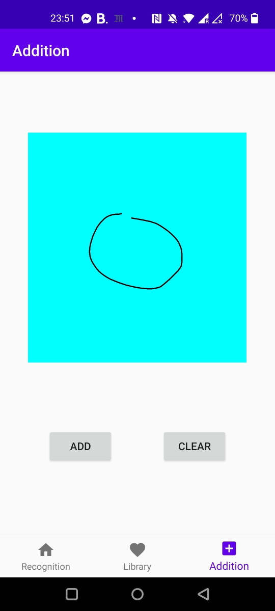
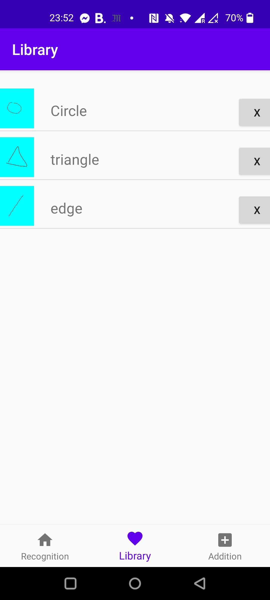
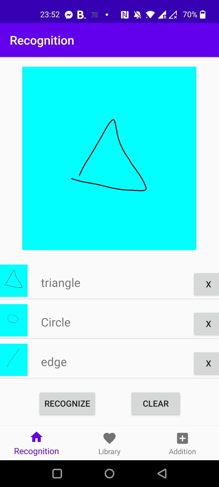

# Shape recognizer

This project is a native android app coded in Kotlin. It is made of 3 different fragments

### The addition fragment
In this view, the user can add a new shape to the library so that the app can learn its pattern and then be able to support its detection.

### The library fragment
In this view the user is able to track all the shapes added so far.

### The recognition fragment
Finally in the recognition fragment, the user can draw any shape, the app will detect the closest shapes in the library and order them from the closest to the most different.

### Recognition algorithm
In the backend the app starts by sampling the shape by creating point at constant intervals such that the shape is converted to an array of points. Then it resize it such that all shapes get the same ratio. Then the shape is rotated such that its barycenter and starting point are aligned on an horizontal line.
Finally it fetches the shapes from the library and search for the one with the smallest distance.
